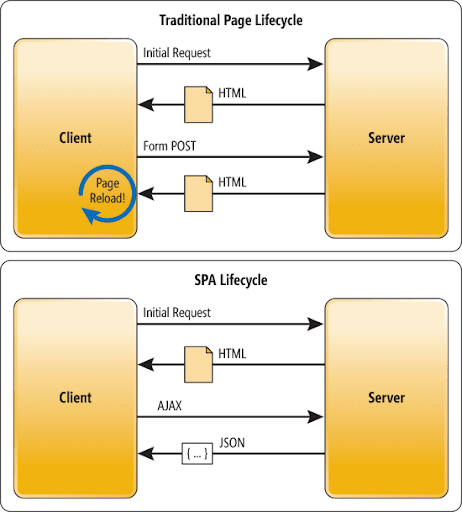

# Fundamento

## **A**synchronous **J**avaScript **A**nd **X**ML

Tradicionalmente los navegadores funcionaban así:
El cliente realizaba un pedido al servidor(_por ejemplo: ingresar a la página de Lgin de Facebook_), el servidor devolvía un documento **_html_**. Luego se tiene que hacer la construcción de la página web (DOM) en todas sus etapas. Después de ello recién en el _layout_ nos aparece el cuadro para loggearnos, la imagen de Facebook, etc.

Ahora, si nosotros realizábamos otro pedido más al servidor, el servidor tenía que devolver otra vez el **html** + **elNuevoPedido**. Esto era muy ineficiente, porque el navegador tenía que volver a hacer todo el mismo proceso y recargar la página.

Desde 2004, Google implementó **AJAX** el cual permitía que cuando el cliente realizara un nuevo pedido al servidor, este sólo devolviera el pedido, y el navegador no tenga que volver a interpretar toda la página. De esta forma es posible interactuar con el servidor sin necesidad de recargar la página web, mejorando la interactividad, velocidad y usabilidad en las aplicaciones.

