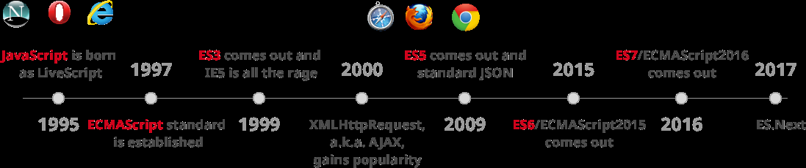

# ES6

## ¿Qué es?

**ECMAScript** es el nombre estandarizado del lenguaje de programación comúnmente conocido como **Javascript**, y ECMAScript2015 (su año de publicación), o **ES6**, hace referencia a la 6ª versión de este lenguaje, superando a la anterior, ES5, nacida en 2011.

## ECMA

**E**uropean **C**omputers **M**anufacturers **A**ssociation.

Ecma International es una organización internacional basada en membresías de
estándares para la comunicación y la información. La organización fue fundada en para estandarizar los sistemas computarizados en Europa. La membresía está abierta a las empresas que producen, comercializan o desarrollan sistemas computacionales o de comunicación en Europa.

> En esta carpeta veremos solo algunos cambios, para verlos todos:
> [ListaDeTodoLosCambios](http://es6-features.org/#Constants)

## COMPATILIDAD

[Babel](https://babeljs.io/) es una plataforma en la que se hace una transcompilación (o traducción) de JavaScript gratuito y de código abierto que se utiliza principalmente para convertir el código ECMAScript 2015+ en una versión de JavaScript compatible con versiones anteriores que pueden ejecutar motores de JavaScript más antiguos.
