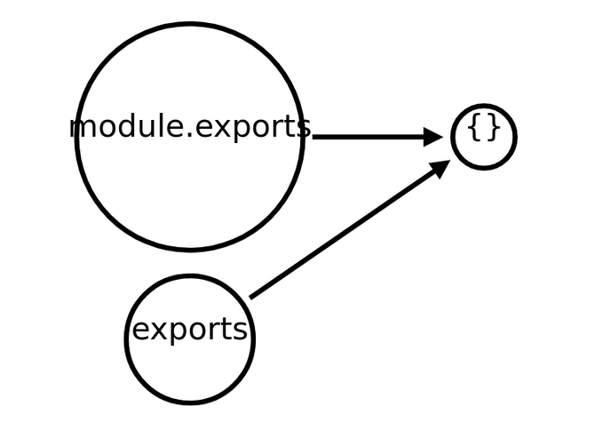

# ModuleExports

La palabra clave `module.exports` apunta al mismo objeto que [exports](./02-CommonJS.md), ya que se pasan por igualdad por referencia.



## Características

```js
//ArchivoNumero1
module.exports.a = function () {
  console.log("a");
};
module.exports.b = function () {
  console.log("b");
};

module.exports = function extra() {
  console.log("Función Extra");
};
```

En ese archivo le hemos agregado dos propiedades (`a` y `b`) a `module.exports`. Sería lo mismo si lo hubiéramos definido con `exports` ya que ambas apuntan al mismo objeto. Luego de definirle esas dos propiedades igualamos a `module.exports` a una _función llamada extra_.

```js
//ArchivoNumero2
var internal = require("./ArchivoNumero1");

internal.a(); // Error
internal.b(); // Error
internal(); // Función Extra
```

En este segundo archivo hemos importado todas las funciones del primero. Sin embargo, a la hora de ejecutarlas la consola nos tira `Error`. Esto se debe a que luego de agregar las propiedades `a` y `b`, igualamos `module.exports` a la `función extra`. Cuando hicimos eso todas las propiedades que tenía este objeto se perdieron, ya que `module.exports` dejó de apuntar al objeto donde se guardan las exportaciones, y pasó a apuntar a esta última función.

## Predominancia

`module.exports` tiene predominancia por sobre `exports`. Es decir que cada vez que exportamos algo, no importa con cuál de las dos palabras claves lo hagamos, siempre en realidad la que se exporta realmente es `module.exports`.

```js
													//ArchivoNumero1
module.exports()            {a} <--------- exports()
					\
           \
					function extra()
```

```js
//ArchivoNumero2
var internal = require("./ArchivoNumero1");

internal.a(); // Error
internal(); // Función Extra
```
