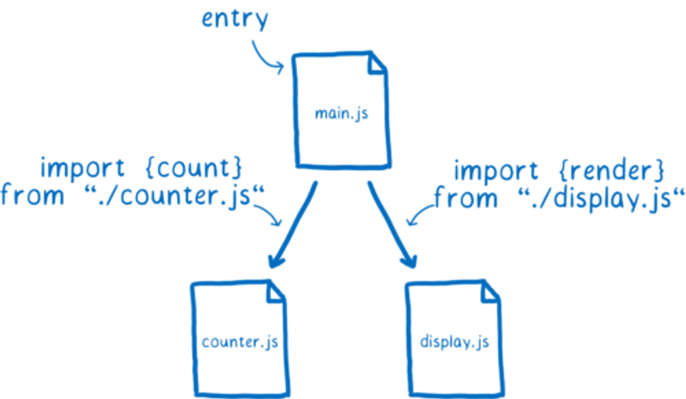

# Módulos

Un **Módulo** es un pedazo de código que cumple una tarea específica y que indica sobre qué piezas de código depende (dependencias).

Los módulos son distintos archivos de código que se entrelazan unos a otros para que la información esté mejor organizada.

