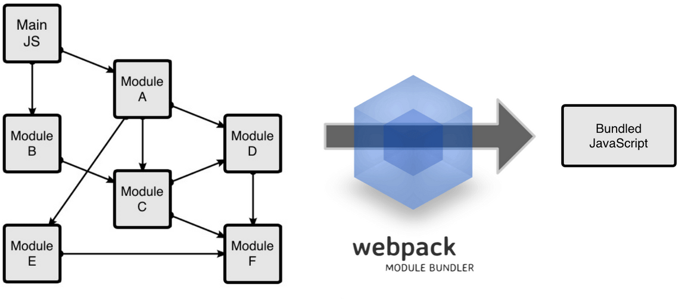

# Bundlers

Cuando hacemos un proyecto que es demasiado grande es muy difícil exportar e importar todos los datos que queremos **uno por uno**. Para poder agilizar este proceso se crean **_archivos de cabecera._** Para poder crear estos _archivos de cabecera_ necesitamos lo que llamamos **bundlers**.

Los **Bundlers** son paquetes con una estructura y extensión definida que permiten agrupar muchos datos de un archivo en un elemento conceptualmente único.


## Webpack

Es un _bundler_ que, como cualquier otro, recorrerá un archivo tomando sus importaciones y dependencias, para devolvernos un archivo único y ordenado.



### Webpack Install & Config

- 1° paso: Crear un nuevo directorio (carpeta).
- 2° paso: Dentro de la carpeta que hemos creado haremos un _package.json_ mediante el comando: `npm init`

  Este debería ser el contenido:

  ```json
  {
    "name": "demowebpack",
    "version": "1.0.0",
    "description": "",
    "main": "index.js",
    "scripts": {
      "test": "echo \"Error: no test specified\" && exit 1"
    },
    "author": "Alejo Bengoechea",
    "license": "ISC"
  }
  ```

  > Cuando hacemos `npm install`, lo que hace NODE es leer todas las dependencias (módulos) del archivo para instalarlas.

- 3° paso: Instalaremos las dependencias webpack y webpack-cli mediante el comando `npm i webpack webpack-cli`. Si volvemos a abrir el _package.json_ deberíamos ver estas dependencias instaladas así:

  ```js
  {
    "name": "demowebpack",
    "version": "1.0.0",
    "description": "prueba",
    "main": "index.js",
    "scripts": {
      "test": "echo \"Error: no test specified\" && exit 1"
    },
    "author": "aouriarte",
    "license": "ISC",
    "dependencies": {
      "webpack": "^5.69.1",
      "webpack-cli": "^4.9.2"
    }
  }
  ```

  > Hacemos `npm install` y NODE instalará todas las dependencias.

- 4° paso: Ahora tendremos que instalar los _scripts_. Estos están asociados a la palabra clave `npm`.

  Exiten dos tipos de _scripts_:

  - En el primero grupo tenemos a **test** y a **start**. El comando a ejecutar es `npm` + `test/start`.
  - En el segundo grupo (el resto), los ejecutamos con `npm` + `run` + `...`. Ejemplo encontramos a `build`.

  ```js
  {
    "name": "demowebpack",
    "version": "1.0.0",
    "description": "prubea",
    "main": "index.js",
    "scripts": {
      "start": "node server.js",
      "build": "webpack"
    },
    "author": "aouriarte",
    "license": "ISC",
    "dependencies": {
      "webpack": "^5.69.1",
      "webpack-cli": "^4.9.2"
    }
  }
  ```

  Dentro de la carpeta demowebpack se creó una nueva carpeta llamada `src`, y dentro de esta crearemos un archivo llamado `server.js`.

- 5° paso: Crearemos un nuevo archivo llamado `webpack.config.js`. Una vez abierto este archivo, pegaremos el siguiente código dentro de él:

  ```js
  module.exports = {
    entry: "./src/server.js", // el punto de arranque de nuestro programa
    output: {
      path: __dirname + "/src", // el path absoluto para
      // el directorio donde queremos que el output sea colocado
      filename: "bundle.js", // el nombre del archivo que va a contener
      //nuestro output - podemos nombrarlo como queramos pero bundle.js es lo típico
    },
  };
  ```

  En **entry** vamos a especificar cuál es el punto de partida (archivo de cabecera) que utilizará Webpack.

  En **output** vamos a especificar donde dejará el **_boundler_** hecho, y con qué nombre lo guardará.

- 6° paso: Teniendo la configuración de **Webpack** hecha, crearemos dentro de la carpeta `src`dos archivos: `module1.js` y `module2.js`. En ambos escribimos funciones.

  Finalmente ejecutamos `npm run build` y veremos el nuevo archivo creado. Este archivo es la unficiación de todos los otros.
