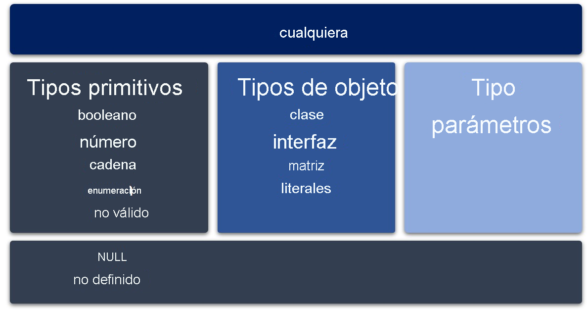

# Tipos y subtipos

Todos los tipos en TypeScript son subtipos de un único tipo principal denominado tipo `any`.



---

## Tipos primitivos

### **string**

También usa comillas dobles (`"`) o comillas simples (`'`).

```ts
let s: string;
let empty = "";
let abc = "abc";
```

En TypeScript, también podemos usar los Template String o Cadena de platilla `${expr}`.

```ts
let firstName: string = "Mateo";
let sentence: string = `My name is ${firstName}. I am new to TypeScript.`;
console.log(sentence); // My name is Mateo. I am new to TypeScript.
```

### **number** y **BigInteger**

Son valores de número de punto flotante o BigIntegers. Estos números de punto flotante obtienen el tipo `number`, mientras que los valores BigIntegers obtiene el tipo `bigint`. Además de los literales hexadecimales y decimales, TypeScript también admite los literales binarios y octales introducidos en ECMAScript 2015.

```ts
let x: number;
let y = 0;
let z: number = 123.456;
let big: bigint = 100n;
```

### **boolean**

Igual que JS.

```ts
let flag: boolean;
let yes = true;
let no = false;
```

### **null** y **undefined**

Son subtipos de todos los demás tipos. No es posible hacer referencia explícita a estos tipos. Por ello se hace referencia mediante los literales `undefined` y `null`.

```ts
let vacio: null = null;
let indefinido: undefined = undefined;
```

### **void**

El tipo `void` existe únicamente para indicar la ausencia de un valor, como en una función sin ningún valor devuelto.

### **enum**

Ofrecen una manera sencilla de trabajar con conjuntos de **constantes** relacionadas. Las enumeraciones se tratan como tipos de datos y se pueden usar a fin de crear conjuntos de constantes para su uso con variables y propiedades. Permiten especificar una lista de opciones disponibles.

De forma predeterminada, los valores enum comienzan con un valor de 0.

```ts
enum DiasDeSemana {
  Lunes, // 0
  Martes, // 1
  Miercoles, // 2
  Jueves, // 3
  Viernes, // 4
  Sabado, // 5
  Domingo, // 6
}

let dia: DiasDeSemana = DiasDeSemana.Jueves;
console.log(dia); // 3
```

> pero podemos cambiar el valor en el que empiecen:

```ts
enum DiasDeSemana {
  Lunes = 1, // 1
  Martes, // 2
  Miercoles, // 3
  Jueves, // 4
  Viernes, // 5
  Sabado, // 6
  Domingo, // 7
}

let dia: DiasDeSemana = 3;
console.log(DiasDeSemana[dia]); // Miercoles
```

---

## Tipos any y unknown

Cuando trabajamos con valores desconocidos en el momento de desarrollar podemos usar los tipos `any` y `unknown`, así como usar la aserción y las restricciones de tipos.

### **any**

Cualquier tipo puede representar cualquier valor de JavaScript sin restricciones. Permitirá volver a asignar distintos tipos de valores.

```ts
let randomValue: any = 10;
randomValue = "Mateo"; // OK
randomValue = true; // OK
```

El uso del tipo `any` en este ejemplo permite llamar a lo siguiente:

- Una propiedad que no existe para el tipo.
- `randomValue` como una función.
- Método que solo se aplica a un tipo string.

Dado que `randomValue` está registrado como `any`, todos los ejemplos siguientes son TypeScript válidos y no generarán un error en **tiempo de compilación**. Sin embargo, pueden producirse errores en **tiempo de ejecución** en función del tipo de datos real de la variable. Dado el ejemplo anterior, donde `randomValue` se establece en un valor _booleano_, las líneas de código siguientes generarán problemas en tiempo de ejecución:

```ts
console.log(randomValue.name); // Logs "undefined" to the console
randomValue(); // Returns "randomValue is not a function" error
randomValue.toUpperCase(); // Returns "randomValue is not a function" error
```

> - **Tiempo de compilación**: Cuando aún no se ejecuta el run.
> - **Tiempo de ejecución**: Cuando se ejecuta el run.

### **unknown**

El tipo `unknown` es similar al tipo `any` en que cualquier valor se puede asignar al tipo `unknown`. Sin embargo, no se puede acceder a las propiedades de un tipo `unknown`; tampoco se pueden llamar ni construir.

```ts
let randomValue: unknown = 10;
randomValue = true;
randomValue = "Mateo";

console.log(randomValue.name); // Error: Object is of type unknown
randomValue(); // Error: Object is of type unknown
randomValue.toUpperCase(); // Error: Object is of type unknown
```

Ahora generará errores de comprobación de tipos y evitará que **compile el código** hasta que tome las medidas adecuadas para resolverlos.

> **DIFERENCIAS**: La diferencia principal entre `any` y `unknown` es que no puede interactuar con una variable de tipo `unknown`; si lo hace, se genera un error del compilador. `any` omite las comprobaciones en tiempo de compilación y el objeto se evalúa en tiempo de ejecución.

### Aserción de tipos

Una aserción de tipos indica a TypeScript que ha realizado cualquier comprobación especial que necesite antes de llamar a la instrucción.

Las aserciones de tipos tienen dos formatos:

- Una es la sintaxis de `as`

```ts
(randomValue as string).toUpperCase();
```

- La otra es de "corchetes angulares"

```ts
(<string>randomValue).toUpperCase();
```

En el ejemplo siguiente se realiza la comprobación necesaria para determinar que `randomValue` es un elemento `string` antes de usar la aserción de tipos a fin de llamar al método `toUpperCase`.

```ts
let randomValue: unknown = 10;
randomValue = true;
randomValue = "Mateo";

if (typeof randomValue === "string") {
  console.log((randomValue as string).toUpperCase()); //* Returns MATEO to the console.
} else {
  console.log("Error - A string was expected here."); //* Returns an error message.
}
```

La aserción de tipos indica que `randomValue` se debe tratar como un elemento `string` y, después, se puede aplicar el método `toUpperCase`.

### Restricciones de tipos

En el ejemplo anterior se muestra el uso de `typeof` en el bloque `if` para examinar el tipo de una expresión en tiempo de ejecución. A esto se le llama **restricción de tipos**.

Se puede usar las siguientes condiciones para descubrir el tipo de una variable:

- `string` -> `typeof s === "string"`
- `number` -> `typeof n === "number"`
- `boolean` -> `typeof b === "boolean"`
- `undefined` -> `typeof undefined === "undefined"`
- `function` -> `typeof f === "function"`
- `array` -> `Array.isArray(a)`

---

## Tipos de objeto y parámetros de tipo

Los tipos de objeto son todos los tipos de clase, de interfaz, de matriz y literales (todo lo que no sea un tipo primitivo).
