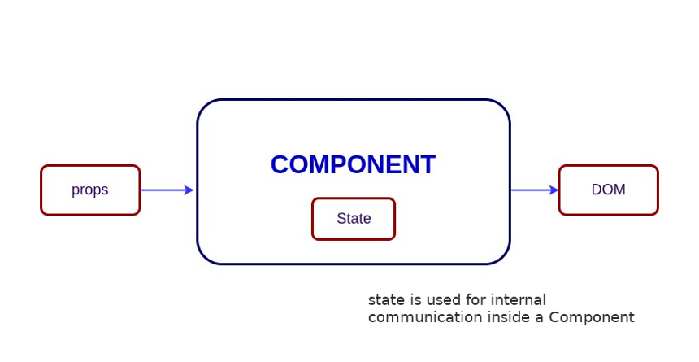
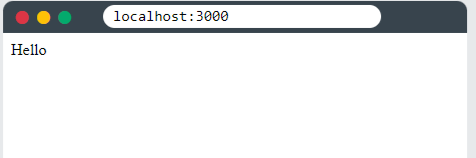

# Componente

Cada componente cumplirá una única función, recibirá una serie de propiedades o atributos y tendrá un estado interno.



> Las **propiedades** que recibe un componente pueden o no ser únicas para este.


Por ejemplo, cuando vamos a la página principal de YouTube vemos que se repiten muchas cajitas con distintos videos; estas “cajitas” son un mismo componente pero repetido. En cambio, el video e información de cada cajita son las propiedades.

## Tipos de componentes

De la misma forma que en JavaScript podemos utilizar una [función](../../00-Languages/JavaScript/02-INTERMEDIATE/03-Functions.md) o una [clase](../../00-Languages/JavaScript/03-POO/03-Clases.md), en React podemos hacer lo mismo.

### Componentes Funcionales

Estos componentes tienen las siguientes características:

1. Los componentes se "fabrican" con `function` y su nombre comienza con mayúscula.

   ```jsx
   function Welcome(props) {
     return <h1>Hello, {props.name}</h1>;
   }
   ```

2. Devuelve con `return` y entre `()` el contenido html.

   ```jsx
   function Nombre(props) {
     return (
       <div>
         <h2>Alexis {props.apellido}</h2>
       </div>
     );
   }
   ```

3. Si queremos escribir contenido JavaScript dentro del contenido del `return` lo haremos entre `{}`

4. En el cuerpo del `return` sólo puede haber un elemento padre. Es decir, no se pueden retornar dos elementos hermanos. Este único elemento padre puede tener todos los elementos hijos que queramos.

   ```jsx
   function Algo() {
      return ( // Esto NO se puede hacer, porque los dos H2 son hermanos.
   	    <h2>Hola</h2>
   	    <h2>Hola</h2>
      )
    }

    function Algo2() {
      return( // Esto SI se puede hacer, porque solo hay un elemento padre.
   	    <div>
   		  <h2>Hola</h2>
   		  <h2>Hola</h2>
   	    </div>
      )
    }
   ```

5. Dentro de la función, pero _por fuera del cuerpo del `return`_ podemos hacer declaraciones en sintaxis de JavaScript, como en el siguiente ejemplo:

   ```jsx
   function Example() {
     var element = (
       <div>
         <h2>Hola, soy Alexis</h2>
       </div>
     );
     return element;
   }
   ```

6. A continuación vemos como invocar un componente dentro de otro:

   ```jsx
   function Nombre() {
     return (
       <div>
         <h1>Alexis</h1> // PRIMER COMPONENTE
         <Apellido />
       </div>
     );
   }

   function Apellido() {
     return <h1>Uriarte</h1>; // SEGUNDO COMPONENTE
   }
   ```

   > Usamos la estructura: `<NombreDelComponente/>` para llamar al componente.

7. Cuando queremos que un componente pueda tomar **propiedades**, le pasaremos la propiedad por _parámetro_, y en el cuerpo del `return` llamaremos a esa propiedad utilizando el parámetro entre `{}`:

   ```jsx
   let props = { name: "Alexis" };

   function Example(props) {
     return ({props.name}) // Alexis
   }
   ```

   > Pero cuando llamamos a un componente dentro de otro, en ese llamado tendremos que especificar la propiedad:

   ```jsx
   function Nombre() {
     return (
       <div>
         <h2>Alexis</h2>
         <Apellido apellido="Uriarte" />
         <Apellido apellido="Vergara" />
       </div>
     );
   }

   function Apellido(props) {
     return <h2>{props.apellido}</h2>;
   }
   //Alexis Uriarte Vergara
   ```

### Componentes de Clase

Tienen las siguientes características:

1. Los construimos con la palabra clave `class` y su nombre empieza con mayúscula.

2. Siempre que hagamos componentes de clase haremos una extensión con `React.Component`.

   ```jsx
   class Example extends React.Component {}
   ```

3. En el cuerpo de la clase usamos un `render()` y dentro el `return`.

   ```jsx
   class Welcome extends React.Component {
     render() {
       return <h1>Hello, my name is Alexis Uriarte</h1>;
     }
   }
   ```

4. Para poder pasarle propiedades a nuestra clase lo haremos con `this`.

   ```jsx
   class Universidad extends React.Component {
     render() {
   	   return (
   		   <h3>Hardvard, {this.props.asistencia}</h3>
   		   <h3>Yale</h3>
   		   <h3>Oxford</h3>
       )
     }
   }
   ```

## ReactDOM.rendwer()

El objetivo de React es representar HTML en una página web. Lo represente mediante una función llamada `ReactDOM.render()`.

La función toma dos argumentos, código HTML (lo que vamos a insertar) y un elemento HTML (dónde lo insertaremos).
El propósito de la función es mostrar el código HTML especificado dentro del elemento HTML especificado.

¿Pero renderizar dónde?

Hay otra carpeta en el directorio raíz de su proyecto React, llamada **"public"**. En esta carpeta, hay un `index.html` archivo.

Notarás un solo `<div>` en el cuerpo de este archivo. Aquí es donde se representará nuestra aplicación React.

Ejemplo:

Mostraremos un párrafo dentro de un elemento con el `id` "root"

```jsx
ReactDOM.render(<p>Hola</p>, document.getElementById("root"));
```

El resultado se muestra en el `<div id="root">`:

<body>
  <div id="root"></div>
</body>

Lo que veríamos en pantalla sería:


