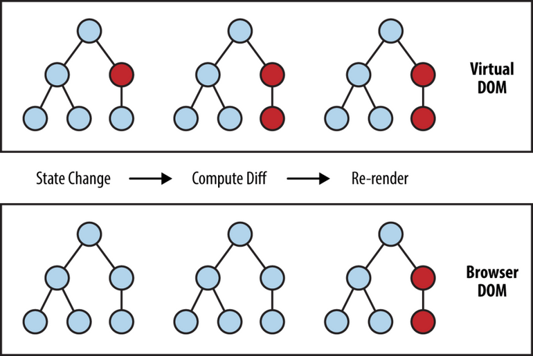
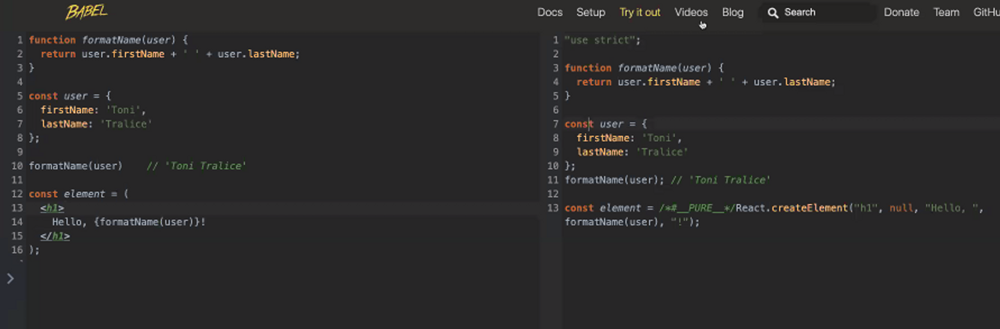

# REACT

Es una librería de [JavaScript](../../00-Languages/JavaScript/about.md) que es **eficiente**, **declarativa** y **flexible**,
y sirve para construir interfaces de usuario (UI). Esta librería fue creada por el equipo de Facebook e Instagram. Fue liberada y ahora es un proyecto [opne source](https://github.com/facebook/react)

- **Declarativo**: Decimos que queremos que se haga. De la forma que lo ejecute JavaScript no nos interesa.

  ```js
  const numbers = [1, 2, 3, 4, 5];

  numbers.reduce(function (p, c) {
    return p + c;
  });
  ```

- **Imperativo**: Decimos cómo queremos que se hagan las cosas.

  ```js
  const numbers = [1, 2, 3, 4, 5];

  let total = 0;
  for (let i = 0; i < numbers.lenght; i++) {
    total += numbers[i];
  }
  ```

- **Eficiente**: Sabemos que cuando realizamos un cambio en el [DOM](../DOM/about.md) este debe renderizarse completamente otra vez, de modo que se pueda darle una lectura a todo el archivo y volverlo a cargar.

  **React** trabaja con un _DOM_ paralelo llamado **reactDOM** (virtual DOM). De esta manera no será necesario realizar un recorrido de todo el archivo cuando realicemos un cambio, ya que cuando lo hacemos, éste cambio se guarda en el _reactDOM_, y mediante algoritmos se hace una comparación entre el _virtual DOM_ y el _browser DOM_. Así sólo se volverá a cargar el cambio que hayamos realizado.

  

## JSX

React usa el "lenguaje" `jsx` que mezcla la sintaxis de escritura entre [JavaScript](../../00-Languages/JavaScript/readme.md) y [xml](https://developer.mozilla.org/es/docs/Web/XML/XML_introduction)

```jsx
const element = <h1>Hello, world!</h1>;
```

Aquí declaramos una variable igual a un título `h1` de _xml_.

```jsx
function formatName(user) {
  return user.firstName + " " + user.lastName;
}

const user = {
  firstName: "Alexis",
  lastName: "Uriarte",
};
const element = <h1>Hello, {formatName(user)}!</h1>;
```

En este ejemplo la consola imprimiría `“Hello, Alexis Uriarte!”`. Las etiquetas `h1` pueden compararse con la sintaxis `${}`.

```jsx
function formatName(user) {
  return user.firstName + " " + user.lastName;
}

var user = {
  firstName: "Alexis",
  lastName: "Uriarte",
};

var element = React.createElement("h1", null, "Hello, ", formatName(user), "!");
```

> [Babel](https://babeljs.io) nos será de gran ayuda. De hecho, siempre que trabajemos en un proyecto con jsx instalaremos las dependencias de Babel, porque estas son las que traducirán el código a la sintaxis normal de JavaScript. Esto es porque los navegadores no pueden interpretar jsx.


