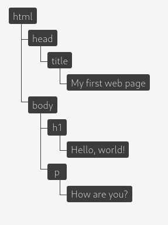
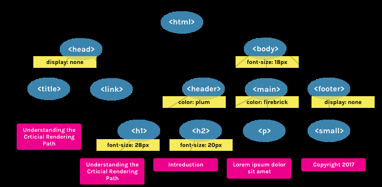
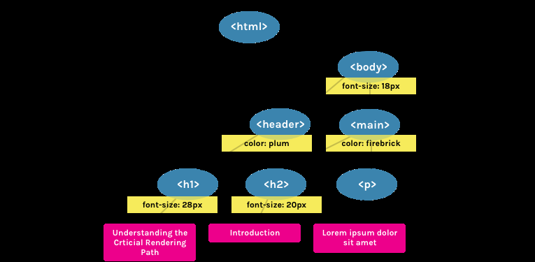

# DOM

**Document Object Model (DOM)** es una interfaz de programación de aplicaciones **(API)** definida para representar o interactuar con cualquier documento **HTML** o **XML**.

## Construcción de una Página

- I) **Construcción del DOM:**
  Cuando el navegador encuentra la etiqueta de apertura `<html>` hasta la etiqueta de cierre, se creará una estructura _árbol_. Esa etiqueta será la etiqueta _raíz_, y a partir de ella, todas las etiquetas de dentro serán hijas.

  

- II) **Construcción del CCSOM:**
  El proceso es el mismo que el anterior, con la diferencia que ahora lee un archivo **_css_** y no **_html_**. El navegador irá recorriendo el árbol ya hecho y preguntará si cada nodo tiene algún **estilo**.

  

- III) **Ejecuta Javascript:**
  Dentro de los archivos **_html_** existe la etiqueta `<script></script>` en la cual podremos insertar todo nuestro código de JavaScript. Es importante destacar que esta etiqueta debe ir al final de la etiqueta `<body></body>` ya que, de caso contrario, en el proceso de lectura, se ejecutarán todas las acciones antes de mostrarnos la interfaz de la página. Es decir, detiene la lectura del archivo **_html_**.

  ```html
  <!DOCTYPE html>
  <html lang="en">
  	<head>
  		<meta charset="UTF-8">
  	<head>
  <body>
  	<h3>HOLA MUNDO<h3>
  	<script>
  		var alejo = "alejo"
  	</script>
  </body>
  </html>
  ```

- IV) **Creación del Render Tree:**
  El **_Render Tree_** es el momento de combinación del **DOM** y el **CSSOM**, en donde se deja sólo los elementos visibles. Es decir, aquí se filtra los elementos que no se visualizarán. Por ejemplo, todo lo que esté dentro de las etiquetas `<head></head>`.

  

- V) **Generación del Layout:**
  El **_Layout_** es lo que determina el tamaño del _viewport_. Esto se configura a través del tag meta viewport.

  ```html
  <!DOCTYPE >
  <html>
    <meta name="viewport" content="width-device-width,initial-scale = 1" />
  </html>
  ```

  > Por ejemplo, esta configuración sirve para dar una pantalla de PC o de Celular.

- VI) **Painting:**
  Esta es la parte en la que lo visible de nuestra página se convierte en pixeles que se muestran en la pantalla. El tiempo de pintado depende del tamaño del DOM, tanto como los estilos que se le aplican.
