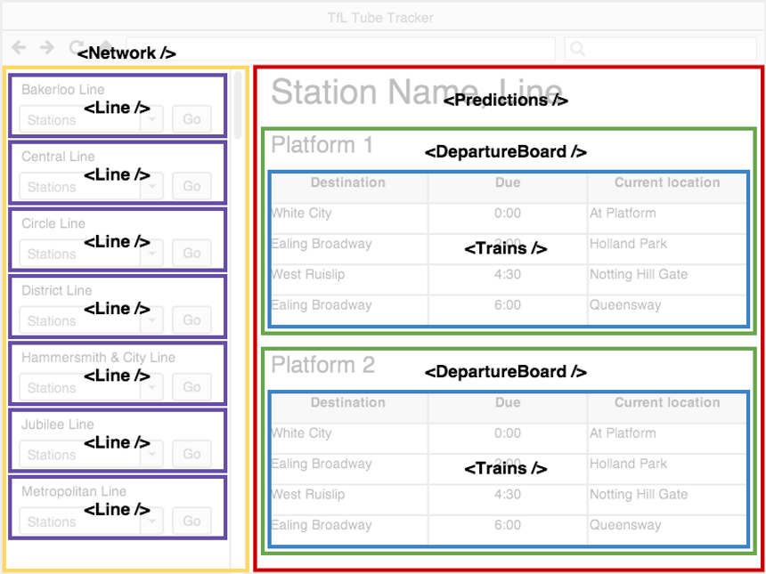
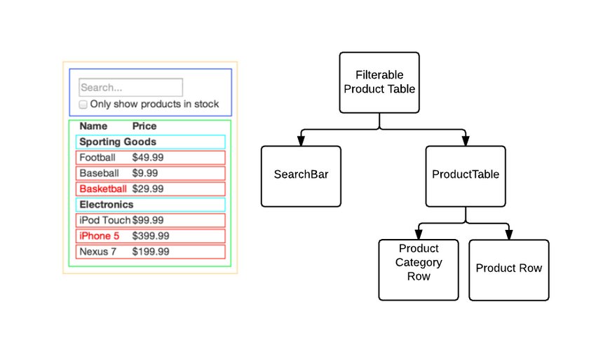

# Intro

## Componet Driven Development

Cuando hacemos una página web, primero creamos el archivo [html](../HTML/readme.md), luego el archivo [css](../CSS/readme.md) y por último el código de [JavaScript](../../00-Languages/JavaScript/readme.md). Con React la escritura es transversal mediante el lenguaje [jsx](./readme.md).

En React existen los **componentes**. Los componentes son elementos con algunos atributos que podremos _**reutilizar** las veces que queramos_.

> Por ejemplo, en esta imagen vemos cuadros contenedores que dentro poseen cuadros con contenidos. En la columna izquierda vemos el componente `<Line/>` repetido muchas veces que es un componente reutilizable.

## Single Responsability Principle

El **Principio de Responsabilidad Única** quiere decir que a cada componente le daremos una única función. Esta especificidad nos permite que cada elemento sea más versátil a la hora de reutilizarlos. Sirve también para darle prolijidad en el código.

