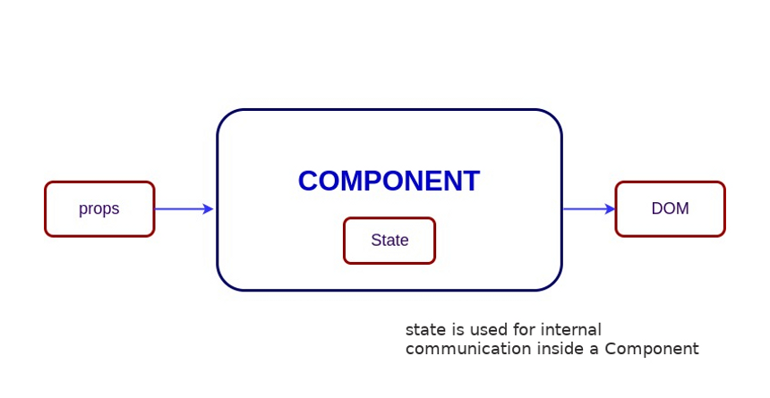

## Estado

Los componentes tienen dos atributos:

- **Propiedades:** Son la _"configuración"_ inicial del componente (los daotos con los que va a ser renderizado). Es la plantilla _padre_ el que le pasa todas estas propiedades a los componentes para que se configuren a partir se ahí. Las propiedades tienen la característica de ser inmutables. Es decir, _no se pueden cambiar_.

- **Estado:** Cada componente, de forma optativa, puede o no tener un estado. Esto es como una variable local única del componente que podemos modificar. Lo que representa este estado es el comportamiento interno que tendrá el componente. Para modificar un estado utilizaremos `this.state`.

Si el estado se modifica, primero se verá afectado el **virtual DOM** y luego el **browser DOM**.



## Estado en los Componentes de Clase

Su estructura es la siguiente:

```js
class ExampleComp extends React.Component {
  render() {
    return (
      <div>
        <h3>Hola {this.props.name}</h3>
        <p>{this.props.contador}</p>
      </div>
    );
  }
}
```

Para poder cambiar el valor de nuestras props, debemos hacerlo a través del estado. Debe inicializarse siempre en algún valor. En componente de clase necesitamos un `contructor` y como React nos obliga siempre a extender un componente de `React.Component` también vamos a tener que utiliar `super()`.

Siempre debemos pasar nuestras propiedades como parámetro en el `contructor` y en el `super()` al trabajar con clases.

```js
class ExampleComp extends React.Component {
  constructor(props) {
    super(props);
  }

  render() {
    return (
      <div>
        <h3>Hola {this.props.name}</h3>
        <p>{this.props.contador}</p>
      </div>
    );
  }
}
```

> STATE
> Destaquemos dos datos importantes. **Primero**, para referirnos al estado vamos a usar `this.state`. Esto es un objeto que estará adentro del constructor de nuestra clase. Lo **segundo** es que las modificaciones que le hagamos al estado se hacen de forma indirecta. Para hacerlas vamos a usar `this.setState`.

```js
class ExampleComp extends React.Component {
  constructor(props) {
    super(props);
    this.state = { contador: this.props.contador };
  }

  render() {
    return (
      <div>
        <h3>Hola {this.props.name}</h3>
        <p>{this.props.start}</p>
        <button
          onClick={() => this.setState({ contador: this.state.contador + 1 })}
        >
          ADD
        </button>
      </div>
    );
  }
}
```

> `this.setState` es el que se encarga de modificar indirectamente al estado.

---

## Life-Cycle

El ciclo de vida se refiere a el tiemo que dura
