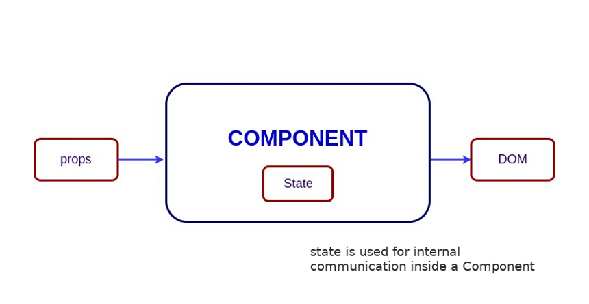

## Estado

Los componentes tienen dos atributos:

- **Propiedades:** Son la _"configuración"_ inicial del componente (los daotos con los que va a ser renderizado). Es la plantilla _padre_ el que le pasa todas estas propiedades a los componentes para que se configuren a partir se ahí. Las propiedades tienen la característica de ser inmutables. Es decir, _no se pueden cambiar_.

- **Estado:** Cada componente, de forma optativa, puede o no tener un estado. Esto es como una variable local única del componente que podemos modificar. Lo que representa este estado es el comportamiento interno que tendrá el componente. Para modificar un estado utilizaremos `this.state`.

Si el estado se modifica, primero se verá afectado el **virtual DOM** y luego el **browser DOM**.

