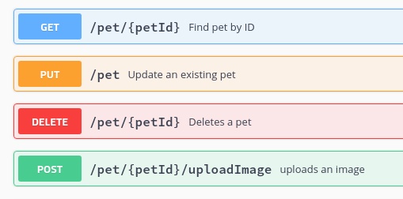

# HTTP METHODS

Para que la comunicación entre el cliente y el servidor se pueda entender, necesitamos lo que se conoce como **Protocolo**. En nuestro caso, el protocolo es **http**. Este tiene una serie de métodos que enlazará el pedido del cliente y la respuesta del servidor.

- **GET:** El cliente **pide información** y el servidor la devuelve. Por ejemplo, cuando queremos _buscar nuestro perfil de Facebook_, la ruta será: facebook.com/AlexisUriarte/.

- **PUT:** Aquí el cliente le pide al servidor **modificar/editar** algún contenido en la web. Por ejemplo, cuando queremos _editar un comentario que hicimos en slack_.

- **DELETE:** Como dice el nombre, el cliente le pide al servidor **eliminar algún dato**. Por ejemplo, cuando _borramos una foto de Instagram_.

- **POST:** Este método es para cuando el cliente quiere realizar un **posteo o publicación** en la web. Por ejemplo, cuando _publicamos algo en nuestro blog_.

