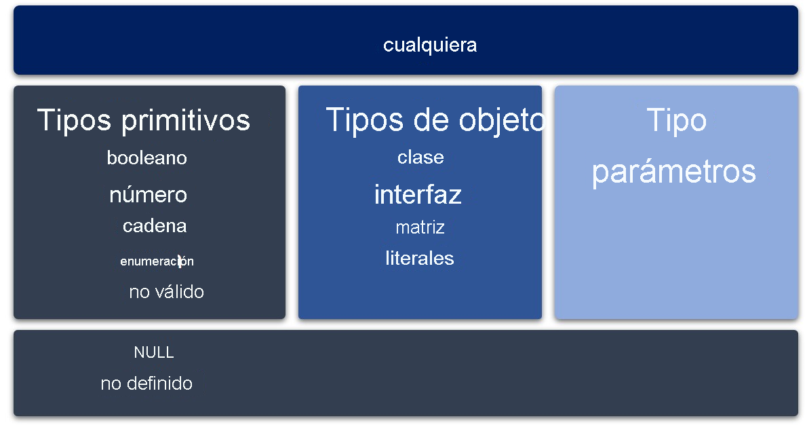

# Tipos y subtipos

Todos los tipos en TypeScript son subtipos de un único tipo principal denominado tipo `any`.

- [Cualquier Tipo](./02-Any%26Unknow.md)
- [Tipos Primitivos](./01-TiposPrimitivos.md)
- [Tipos de Objeto](./02-TiposDeObjeto.md)
- [Tipos Parámetros]()
